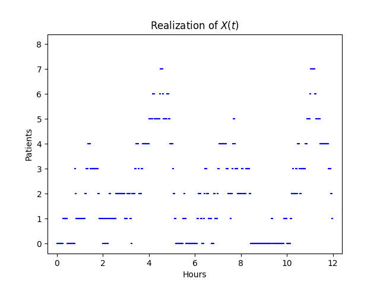
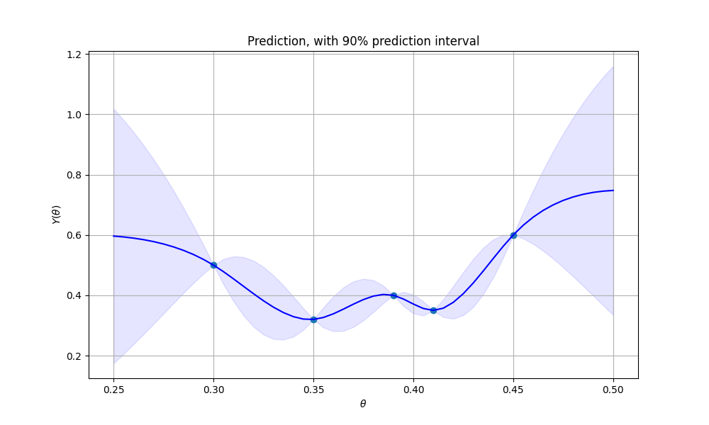

# Urgent-care queues
Project from the course TMA4265 Stochastic Modelling  at NTNU.  

We want to simulate the expected waiting and treatment times for patients arriving at an urgent care center. In the first scenario all arrivals are treated equally. In the second scenarios some patients are considered more urgent than others. See report for details.  
  
### Featured plot

# Climate-model calibration

We also want to calibrate a climate model. Very simply treated here. For more info see report [here](https://github.com/kwillno/UrgentCareQueues/blob/main/ProjectReport.pdf) and codefiles.  

### Featured plot

